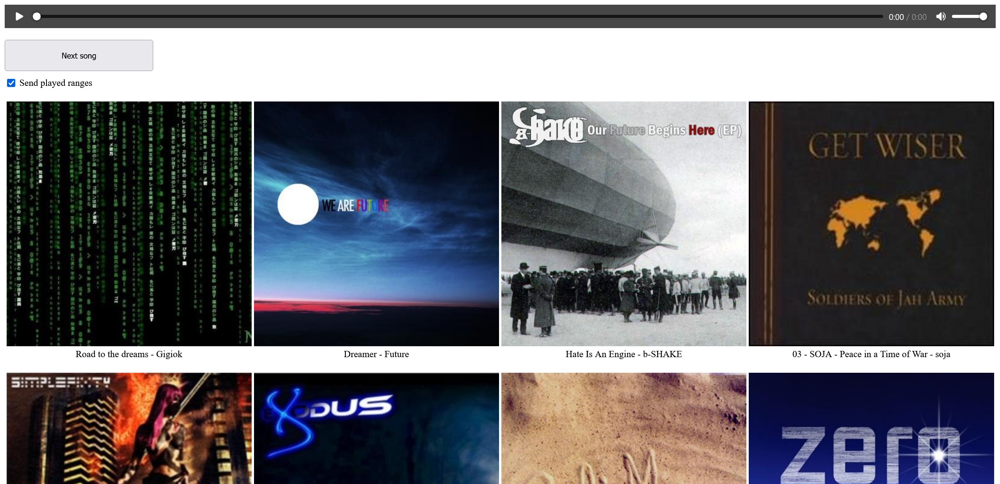

# musicplayer
Barebones music player (web GUI) with a more human-friendly random shuffle and that logs play history.

## How to run
1. Install the dependencies (which can be done using `pip install -r requirements.txt`)
2. Run musicplayer.py, your web browser should open automatically.

There are a few additional scripts: combine.py combines multiple db files together (which I found useful due to sync conflicts when I use Syncthing to sync this tool) and read.py, which provides a rough example of reading the dbs and showing the most/least played songs.

## Features/possible future features
- [x] Display a grid view of songs with thumbnails (dependant on music metadata, may need to add more cases).
- [ ] Allow playback from multiple devices (such as phones), such that music plays synced in real time between them.
- [ ] Allow the browser to request the list of songs rather than have them generated in the HTML on startup (which would allow new songs to be loaded on the fly instead of by restarting the program).

## License
[See COPYING](COPYING)